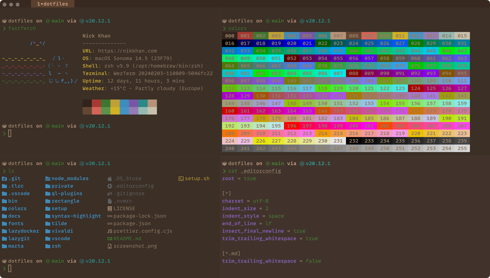

# ~nicksp 🌮

My personal dotfiles for configuring macOS with Zsh and Homebrew.



> [!IMPORTANT]
> Please only open pull requests that fix bugs or add improvements without any breaking changes.

> [!WARNING]
> I recommend forking this repository to create your own set of dotfiles.

## Requirements

- macOS
- Homebrew (the install script will install Homebrew)
- Zsh (the install script will install Zsh via Homebrew)

## What's in there?

- Handy [binary scripts](bin/).
- AI agents [config automation](ai-agents/).
- [Custom color scheme](colors/).
- [Custom zsh theme](tilde/.starship.toml) with Git status, etc. using [Starship](https://starship.rs/).
- [Git aliases](tilde/.gitconfig).
- [Shell aliases](zsh/aliases.zsh).
- zsh / [fzf](zsh/fzf.zsh).
- git / delta syntax-highlighting diff tool.
- Sensible [macOS defaults](setup/macos.sh).
- [Visual Studio Code](./vscode/) and [Cursor](./cursor/) settings synchronization.
- Config for other apps and utils.
- [macOS apps and VSCode / Cursor extensions](setup/Brewfile) I use.
- [macOS tips & tricks](/docs/macos%20tips%20&%20tricks.md).
- [LLM cost reduction tips](/docs/llm%20cost%20reduction.md).
- [Claude Code best practices](/docs/claude%20code%20best%20practices.md).

## Installation

1. Point the DNS Servers to [Cloudflare DNS](https://one.one.one.one/dns/)
    - `1.1.1.1`
    - `1.0.0.1`
    - `2606:4700:4700::1111`
    - `2606:4700:4700::1001`
1. Configure Git and GitHub SSH
    1. [Generate SSH key and add it to the ssh-agent](https://docs.github.com/en/authentication/connecting-to-github-with-ssh/generating-a-new-ssh-key-and-adding-it-to-the-ssh-agent)
    1. [Add your public SSH key to GitHub account](https://docs.github.com/en/authentication/connecting-to-github-with-ssh/adding-a-new-ssh-key-to-your-github-account)
    1. Test your authentication with:

        ```
        ssh -T git@github.com
        ```

1. Configure [GPG commit signature verification](https://docs.github.com/en/authentication/managing-commit-signature-verification/about-commit-signature-verification#gpg-commit-signature-verification)
1. Install [MonoLisa font](https://www.monolisa.dev/)
1. Choose _manual_ or _automatic_ dotfiles installation below

### Manually

```shell
git clone git@github.com:nicksp/dotfiles.git ~/dotfiles
cd ~/dotfiles
./setup/zsh.sh
./setup/brew.sh
./setup/misc.sh
./setup/symlinks.sh
```

### Automatically

To automate the setup of your dotfiles on a new machine, use the [setup](./setup.sh) script.

> [!CAUTION]
> Use at your own risk!

```shell
git clone git@github.com:nicksp/dotfiles.git ~/dotfiles
~/dotfiles/setup.sh
```

This will install all required dotfiles in your home directory as symlinks. Everything is then configured via modifying files in `~/dotfiles`.

## Extras

### Set macOS defaults

```shell
set-defaults
```

### Use alternative apps icons

```shell
sync-apps-icons
```

### Install colors themes

```shell
sync-color-themes
```

## Local customizations

The dotfiles can be extended to suit additional local
requirements by using the following files:

#### `~/.zsh.local`

If this file exists, it will be automatically sourced
after all the other shell related files allowing its
content to add to or overwrite the existing aliases, settings, PATH,
etc.

#### `~/.gitconfig.local`

If this file exists, it will be automatically
included after the configurations from `~/.gitconfig` allowing
its content to overwrite or add to the existing `git` configurations.

> [!TIP]
> Use `~/.gitconfig.local` to store sensitive information such
as the `git` user credentials for individual repositories.

## Updating

To update an existing install:

```shell
cd ~/dotfiles
git pull
./setup.sh
```

## License

MIT License.

## Inspiration

- [holman/dotfiles](https://github.com/holman/dotfiles)
- [mathiasbynes/dotfiles](https://github.com/mathiasbynens/dotfiles)
- [sapegin/dotfiles](https://github.com/sapegin/dotfiles)
- <https://remysharp.com/2018/08/23/cli-improved>
- <https://evanhahn.com/a-decade-of-dotfiles/>
- <https://cpojer.net/posts/set-up-a-new-mac-fast>
- <https://thevaluable.dev/zsh-install-configure-mouseless/>
