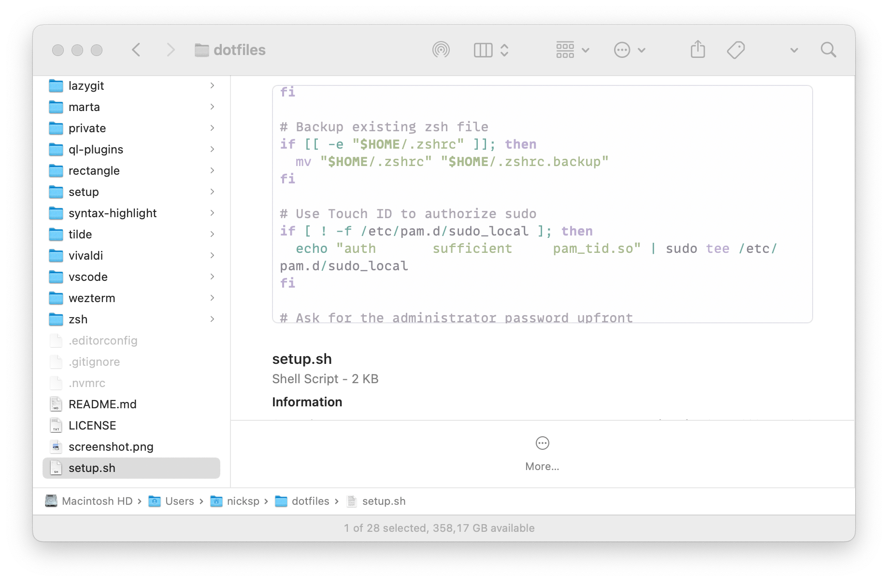
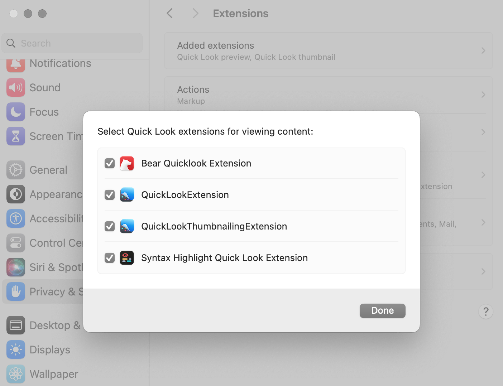

# Syntax Highlight

This folder holds a custom color schema for the [Syntax Highlight](https://github.com/sbarex/SourceCodeSyntaxHighlight) Quick Look extension. The installation is handled semi-automatically via the [binary script](../bin/sync-color-themes).

> [!IMPORTANT]
> To use the Quick Look preview you must launch the Application at least once. In this way the Quick Look Extension will be discovered by the system and will be available in the **System Settings** → **Privacy & Security** → **Extensions** → **Quick Look**.

